# TicketDesk - AI-Powered Smart Support System

[](https://reactjs.org/)
[](https://www.typescriptlang.org/)
[](https://nodejs.org/)
[](https://www.mongodb.com/)
[](https://openai.com/)

## Description
TicketDesk is a full-stack, role-based support ticket management system designed for modern teams. Employees submit tickets, agents resolve them with AI-assisted replies, and admins oversee analytics. Built with React, Node.js, MongoDB, and OpenAI integration for intelligent support workflows.

## Features

- **Role-Based Portals**: Employee, Agent, and Admin dashboards
- **Ticket Lifecycle**: Create, assign, update status/priority, timelines, comments
- **AI Reply Suggestions**: OpenAI-powered auto-generated responses for agents
- **Real-Time Notifications**: Socket.io for instant updates
- **Analytics Dashboards**: Charts for ticket metrics (Chart.js)
- **Secure Auth**: JWT-based authentication with protected routes
- **Rich Comments**: Threaded discussions on tickets

## Tech Stack
| Frontend | Backend | Database | Other |
|----------|---------|----------|--------|
| React 19 | Node.js/Express | MongoDB (Mongoose) | OpenAI, Socket.io |
| TypeScript | TypeScript | | Chart.js, Axios |
| Vite | ts-node/nodemon | | JWT, bcrypt |

##  Quick Start

### Prerequisites
- Node.js 20+
- MongoDB
- OpenAI API key

### Setup Instructions

1. **Clone the repository**
   ```bash
   git clone <repository-url>
   cd supportSystem
   ```

2. **Backend Setup**
   ```bash
   cd support-system-backend
   npm install
   ```
   - Create `.env` file with:
     ```
     MONGODB_URI=your_mongodb_uri
     OPENAI_API_KEY=your_openai_key
     JWT_SECRET=your_jwt_secret
     PORT=5000
     ```
   - Run: `npm run dev`

3. **Frontend Setup**
   ```bash
   cd ../smart-support-desk
   npm install
   npm run dev
   ```

4. **Access the app**
   - Frontend: `http://localhost:5173`
   - Backend API: `http://localhost:5000`

## Screenshots

### Authentication
<div align="center">
  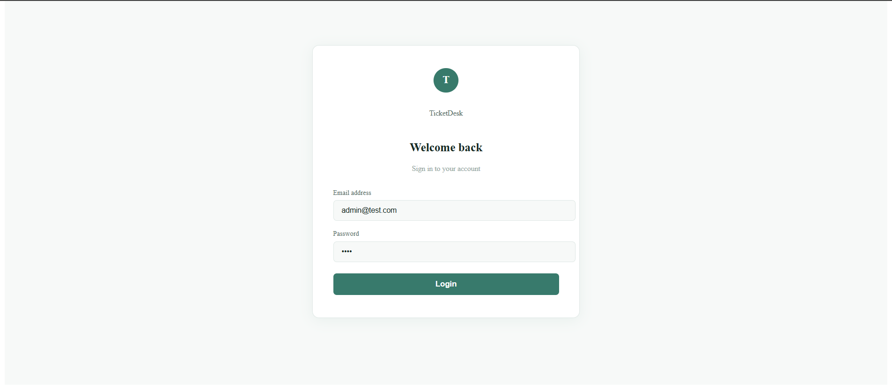
  <p><strong>Login Screen</strong> - Secure JWT-based authentication</p>
</div>

---

### Employee Portal
<div align="center">
  <table>
    <tr>
      <td>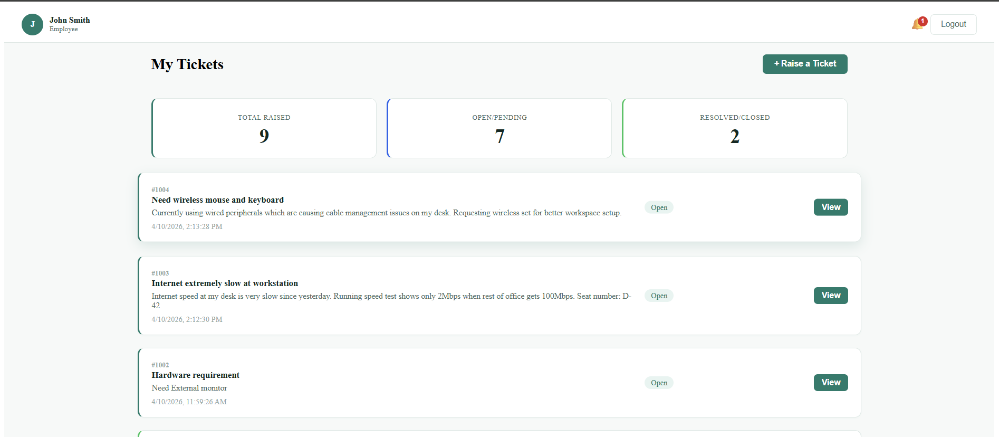</td>
      <td>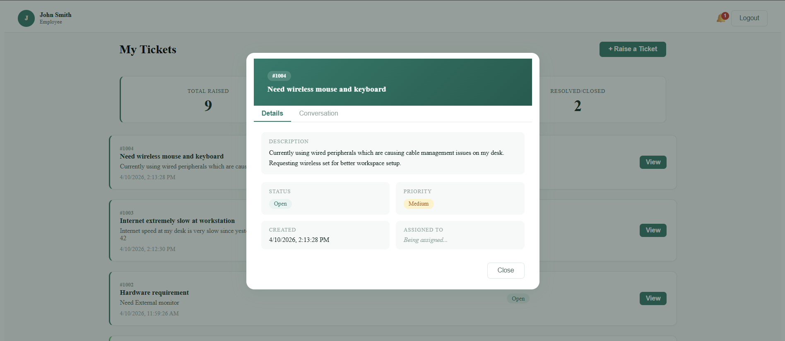</td>
    </tr>
    <tr>
      <td align="center"><strong>Dashboard</strong></td>
      <td align="center"><strong>Ticket Details</strong></td>
    </tr>
  </table>
</div>

---

### Agent Dashboard
<div align="center">
  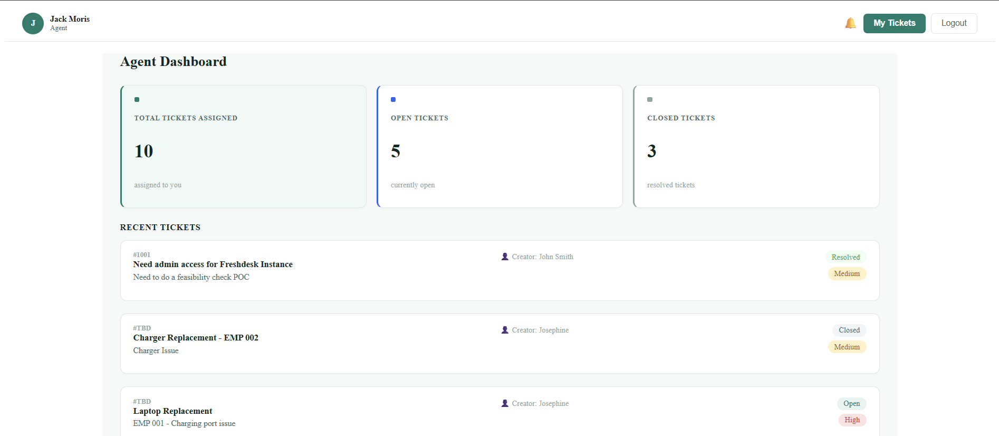
  <p><strong>Agent Dashboard</strong> - Manage and resolve support tickets</p>
</div>

<div align="center">
  <table>
    <tr>
      <td>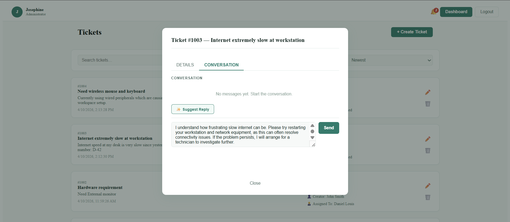</td>
      <td>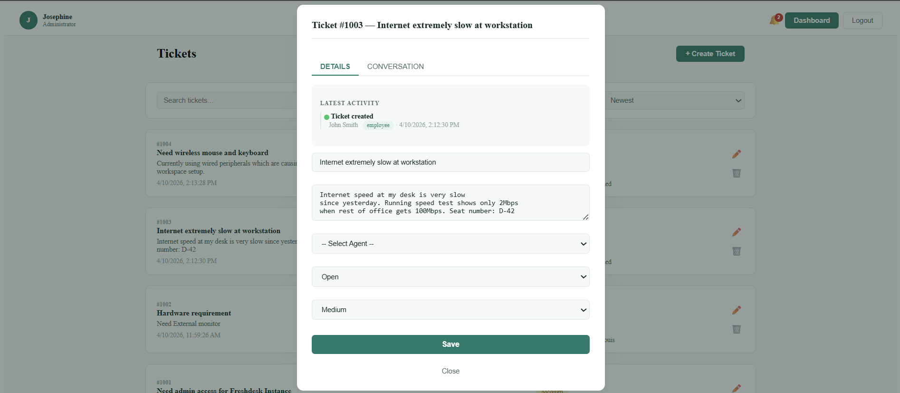</td>
    </tr>
    <tr>
      <td align="center"><strong>AI-Powered Reply Suggestions</strong></td>
      <td align="center"><strong>Ticket Analysis</strong></td>
    </tr>
  </table>
</div>

---

### Admin Dashboard
<div align="center">
  <table>
    <tr>
      <td>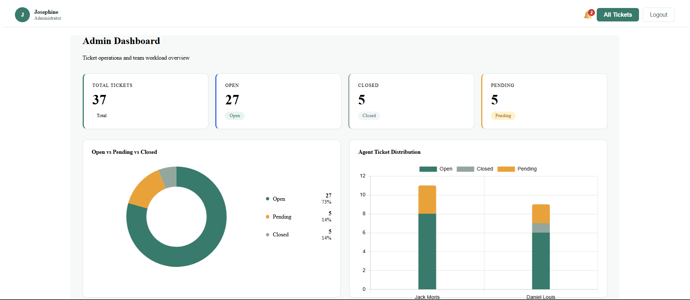</td>
      <td>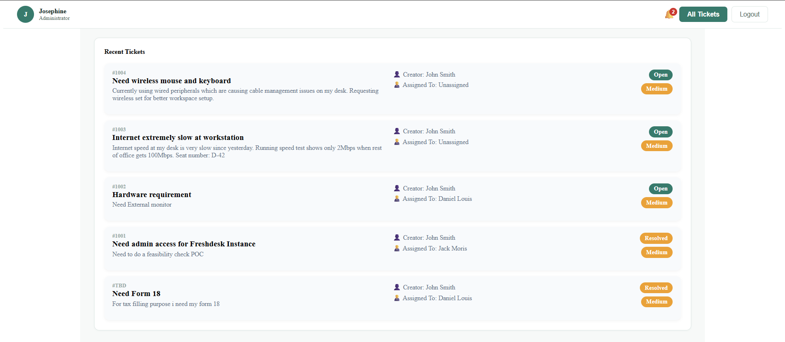</td>
    </tr>
    <tr>
      <td align="center"><strong>Analytics Overview</strong></td>
      <td align="center"><strong>Detailed Metrics</strong></td>
    </tr>
  </table>
</div>

<div align="center">
  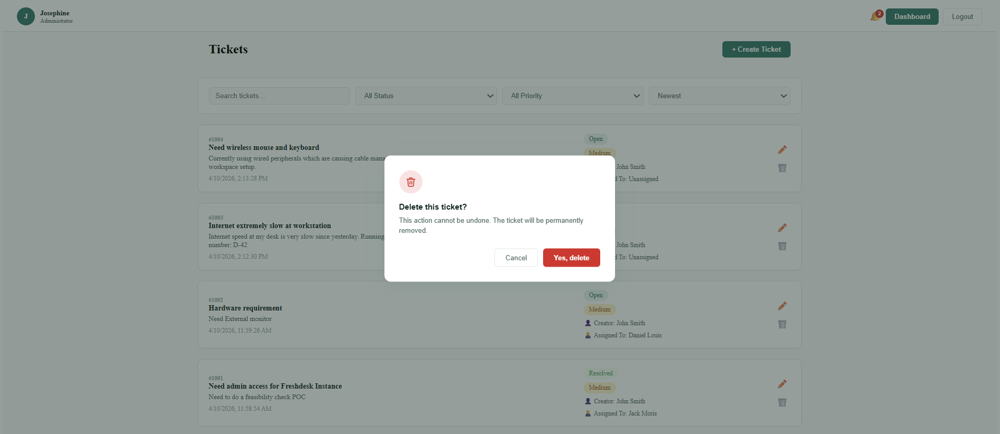
  <p><strong>Delete Ticket</strong> - Remove tickets from the system</p>
</div>

---

### Notifications & Support
<div align="center">
  <table>
    <tr>
      <td>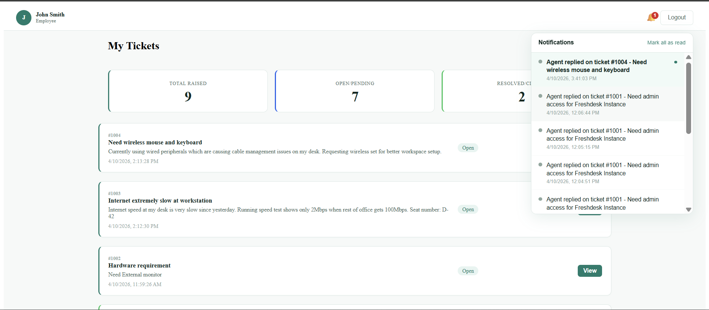</td>
      <td>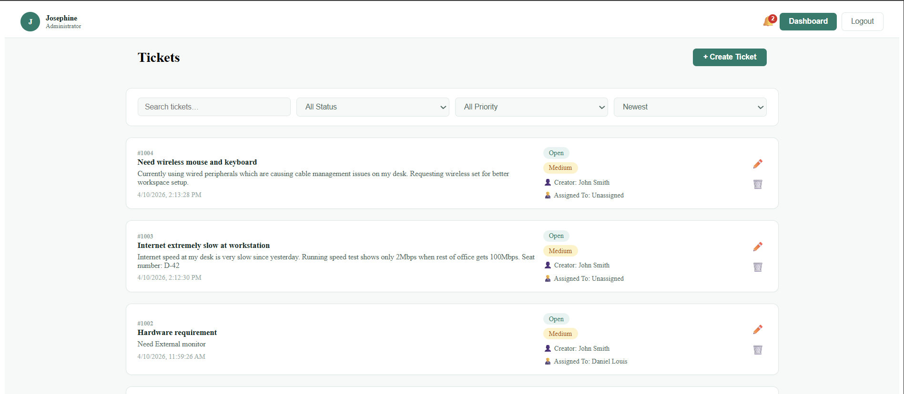</td>
    </tr>
    <tr>
      <td align="center"><strong>Real-Time Notifications</strong></td>
      <td align="center"><strong>Ticket Management</strong></td>
    </tr>
  </table>
</div>
